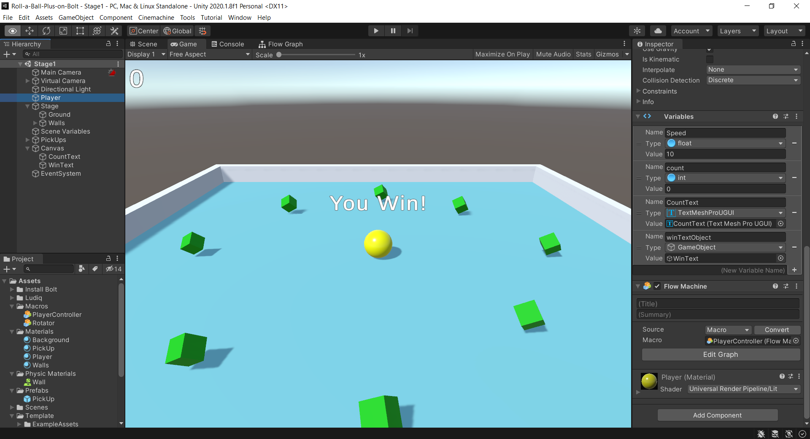

# Roll-a-Ball-Plus-on-Bolt

A Sample Unity Project for learning on Bolt.

# Screenshot

# Requirement

* Unity version

  2020.1.8f1

* Assets & packages for this project
  * URP
  * Text Mesh Pro
  * Bolt 

# Installation

Need to install Bolt package. Refer to the following link.

https://51n1.uk/post/roll-a-ball-on-bolt-3.html

When you configure Bolt, you should add "Unity.TextMeshPro" as Assembly Options if you use TextMeshPro.

# Recommended Tutorial

"Roll-a-Ball" at Unity Learn

https://learn.unity.com/project/roll-a-ball

"Unity入門チュートリアル 「玉転がし」(Roll-a-Ball) ビジュアルスクリプティング版" at Unity Learn

https://learn.unity.com/project/bolt-roll-a-ball-tutorial

# License

The only content I contributed is [CC0-1.0](https://creativecommons.org/publicdomain/zero/1.0/).

